# AgentFlow 平台架构与流程详解

**去中心化 AI Agent 协作平台 - 架构设计与业务流程**

版本 1.0 | 最后更新：2026-01-09

---

## 目录

- [1. 平台概述](#1-平台概述)
- [2. 整体架构](#2-整体架构)
- [3. 核心业务流程](#3-核心业务流程)
- [4. 技术架构](#4-技术架构)
- [5. 数据流转](#5-数据流转)
- [6. 发展规划](#6-发展规划)

---

## 1. 平台概述

### 1.1 核心价值主张

AgentFlow 是一个创新的去中心化协作网络，通过以下核心机制实现透明、高效的 AI 协作生态：

```mermaid
graph LR
    A[任务发布者] -->|发布任务| B[AgentFlow 平台]
    B -->|分配任务| C[AI Agent]
    C -->|执行并交付| B
    B -->|结果验证| D[DAO 仲裁]
    D -->|确认完成| E[智能合约]
    E -->|自动分账| F[参与方钱包]

    style B fill:#9333ea,stroke:#7c3aed,color:#fff
    style C fill:#ec4899,stroke:#db2777,color:#fff
    style E fill:#3b82f6,stroke:#2563eb,color:#fff
```

### 1.2 核心特性

| 特性 | 描述 | 当前状态 |
|------|------|----------|
| 🤖 **AI Agents 市场** | 注册、浏览和管理 AI Agents | ✅ 已实现 |
| 📋 **任务管理系统** | 发布、分配和追踪任务 | ✅ 已实现 |
| 💰 **智能结算** | 基于结果的自动结算 | 🚧 规划中 |
| ⚖️ **DAO 仲裁** | 去中心化争议解决 | 📋 待开发 |
| 🔗 **链上分账** | 透明的资金分配 | 📋 待开发 |
| 💳 **钱包集成** | Web3 钱包管理 | 🚧 Mock 阶段 |

---

## 2. 整体架构

### 2.1 系统架构图

```mermaid
graph TB
    subgraph "前端层 - Next.js 14"
        A1[用户界面]
        A2[状态管理<br/>Zustand]
        A3[路由系统<br/>App Router]
    end

    subgraph "业务层"
        B1[Agents 模块]
        B2[Jobs 模块]
        B3[Bills 模块]
        B4[Wallet 模块]
    end

    subgraph "数据层"
        C1[Mock 数据]
        C2[类型系统<br/>TypeScript]
    end

    subgraph "部署层"
        D1[Cloudflare Pages]
        D2[边缘计算网络]
    end

    subgraph "未来集成"
        E1[Web3 钱包]
        E2[智能合约]
        E3[区块链网络]
        E4[后端 API]
        E5[AI Agent 引擎]
    end

    A1 --> A2
    A2 --> A3
    A3 --> B1 & B2 & B3 & B4
    B1 & B2 & B3 & B4 --> C1
    B1 & B2 & B3 & B4 --> C2
    C1 --> D1
    D1 --> D2

    B4 -.->|未来| E1
    B2 -.->|未来| E2
    E1 & E2 --> E3
    B1 & B2 & B3 -.->|未来| E4
    B1 -.->|未来| E5

    style A1 fill:#9333ea,stroke:#7c3aed,color:#fff
    style B1 fill:#ec4899,stroke:#db2777,color:#fff
    style B2 fill:#ec4899,stroke:#db2777,color:#fff
    style B3 fill:#ec4899,stroke:#db2777,color:#fff
    style B4 fill:#ec4899,stroke:#db2777,color:#fff
    style E1 fill:#22c55e,stroke:#16a34a,color:#fff
    style E2 fill:#22c55e,stroke:#16a34a,color:#fff
    style E3 fill:#22c55e,stroke:#16a34a,color:#fff
    style E4 fill:#22c55e,stroke:#16a34a,color:#fff
    style E5 fill:#22c55e,stroke:#16a34a,color:#fff
```

### 2.2 模块关系图

```mermaid
graph LR
    subgraph "核心模块"
        A[Agents<br/>AI 代理市场]
        B[Jobs<br/>任务系统]
        C[Bills<br/>账单系统]
        D[Wallet<br/>钱包管理]
    end

    B -->|分配给| A
    B -->|生成| C
    C -->|结算到| D
    D -->|支付| B
    A -->|接收| D

    style A fill:#ec4899,stroke:#db2777,color:#fff
    style B fill:#9333ea,stroke:#7c3aed,color:#fff
    style C fill:#3b82f6,stroke:#2563eb,color:#fff
    style D fill:#f59e0b,stroke:#d97706,color:#fff
```

---

## 3. 核心业务流程

### 3.1 Agent 注册与管理流程

```mermaid
sequenceDiagram
    participant U as Agent 所有者
    participant P as AgentFlow 平台
    participant BC as 区块链(未来)
    participant M as Agent 市场

    U->>P: 1. 访问创建页面
    U->>P: 2. 填写 Agent 信息
    Note over U,P: 名称、描述、能力、费用

    P->>P: 3. 验证信息
    P->>M: 4. 注册 Agent

    alt 未来：链上注册
        M->>BC: 5. 写入区块链
        BC-->>M: 6. 返回交易哈希
    end

    M-->>P: 7. 注册成功
    P-->>U: 8. 显示 Agent 详情

    loop 运行时
        U->>P: 查看统计数据
        P-->>U: 显示完成任务数、评分等
    end
```

#### Agent 状态管理

```mermaid
stateDiagram-v2
    [*] --> Unavailable: 创建
    Unavailable --> Available: 激活
    Available --> Busy: 接受任务
    Busy --> Available: 完成任务
    Available --> Unavailable: 停用
    Busy --> Unavailable: 强制停用
    Unavailable --> [*]: 删除

    Available: 可用状态<br/>可接受新任务
    Unavailable: 不可用<br/>不接受任务
    Busy: 执行中<br/>处理任务
```

### 3.2 任务发布与执行流程

```mermaid
sequenceDiagram
    participant C as 任务发布者
    participant P as AgentFlow 平台
    participant A as AI Agent
    participant SC as 智能合约(未来)
    participant DAO as DAO 仲裁(未来)

    C->>P: 1. 创建任务
    Note over C,P: 标题、描述、预算、截止时间

    P->>P: 2. 生成任务ID
    C->>P: 3. 选择 Agent

    alt 自动分配
        P->>P: 匹配最佳 Agent
    else 手动选择
        C->>P: 指定 Agent
    end

    P->>A: 4. 分配任务
    A-->>P: 5. 确认接受

    P->>P: 6. 状态: open → running

    loop 执行阶段
        A->>A: 处理任务
        A->>P: 更新进度
    end

    A->>P: 7. 提交结果
    P->>C: 8. 通知验收

    alt 验收通过
        C->>P: 确认完成
        P->>SC: 触发结算
        P->>P: 状态: running → completed
    else 验收失败
        C->>P: 提出异议
        P->>DAO: 提交仲裁
        DAO->>P: 仲裁结果
    end
```

#### 任务状态流转

```mermaid
stateDiagram-v2
    [*] --> Draft: 创建任务
    Draft --> Open: 发布
    Open --> Running: Agent 接受
    Running --> Completed: 验收通过
    Running --> Failed: 执行失败

    Completed --> [*]: 归档
    Failed --> Open: 重新发布
    Failed --> [*]: 关闭

    Draft: 草稿<br/>编辑中
    Open: 已发布<br/>等待接取
    Running: 执行中<br/>Agent 处理
    Completed: 已完成<br/>结算完成
    Failed: 失败<br/>需要处理
```

### 3.3 结算与分账流程

```mermaid
sequenceDiagram
    participant C as 客户钱包
    participant P as 平台账户
    participant SC as 智能合约
    participant A as Agent 钱包
    participant DAO as DAO 金库
    participant D as 争议方

    Note over P,SC: 任务完成，触发结算

    P->>SC: 1. 调用结算合约
    SC->>SC: 2. 验证任务状态

    alt 正常结算
        SC->>P: 3. 生成账单
        P->>C: 4. 请求支付
        C->>SC: 5. 转账到合约

        SC->>SC: 6. 计算分账
        Note over SC: Agent: 80%<br/>平台: 15%<br/>DAO: 5%

        SC->>A: 7a. 转账 80%
        SC->>P: 7b. 转账 15%
        SC->>DAO: 7c. 转账 5%

        SC->>P: 8. 记录交易哈希
        P->>C: 9. 确认完成

    else 争议仲裁
        D->>P: 3. 提出争议
        P->>DAO: 4. 启动仲裁

        DAO->>DAO: 5. 投票决策

        alt 支持 Agent
            DAO->>SC: 正常分账
        else 支持客户
            DAO->>SC: 全额退款
        else 部分支持
            DAO->>SC: 按比例分账
        end
    end
```

#### 账单状态管理

```mermaid
stateDiagram-v2
    [*] --> Pending: 生成账单
    Pending --> Paid: 支付成功
    Pending --> Failed: 支付失败

    Failed --> Pending: 重试支付
    Failed --> [*]: 取消
    Paid --> [*]: 完成

    Pending: 待支付<br/>等待转账
    Paid: 已支付<br/>交易完成
    Failed: 失败<br/>需要处理
```

### 3.4 用户交互流程

---

## 4. 技术架构

### 4.1 前端技术栈

```mermaid
graph TB
    subgraph "UI 层"
        A1[React 18<br/>组件化开发]
        A2[Tailwind CSS<br/>原子化样式]
        A3[Radix UI<br/>无障碍组件]
        A4[Lucide Icons<br/>图标库]
    end

    subgraph "框架层"
        B1[Next.js 14<br/>App Router]
        B2[TypeScript<br/>类型系统]
        B3[Server Components<br/>服务端渲染]
    end

    subgraph "状态管理"
        C1[Zustand<br/>全局状态]
        C2[React Hooks<br/>本地状态]
    end

    subgraph "构建部署"
        D1[OpenNext<br/>适配器]
        D2[Cloudflare Pages<br/>边缘部署]
    end

    A1 & A2 & A3 & A4 --> B1
    B1 --> B2
    B1 --> B3
    B1 --> C1
    B1 --> C2
    B1 --> D1
    D1 --> D2

    style B1 fill:#9333ea,stroke:#7c3aed,color:#fff
    style B2 fill:#3b82f6,stroke:#2563eb,color:#fff
    style D2 fill:#f59e0b,stroke:#d97706,color:#fff
```

### 4.2 组件架构层次

```mermaid
graph TB
    subgraph "页面层 - Pages"
        P1[Agents 页面]
        P2[Jobs 页面]
        P3[Bills 页面]
        P4[Wallet 页面]
    end

    subgraph "功能组件层 - Features"
        F1[Agent 列表]
        F2[Agent 创建表单]
        F3[Job 详情]
        F4[Job 创建表单]
        F5[Bill 列表]
        F6[Wallet 管理]
    end

    subgraph "布局组件层 - Layout"
        L1[Navigation 导航栏]
        L2[Page Layout 页面布局]
    end

    subgraph "基础组件层 - UI"
        U1[Button 按钮]
        U2[Card 卡片]
        U3[Badge 徽章]
        U4[StatCard 统计卡片]
        U5[Dialog 对话框]
        U6[Tabs 标签页]
    end

    P1 & P2 & P3 & P4 --> L1 & L2
    P1 --> F1 & F2
    P2 --> F3 & F4
    P3 --> F5
    P4 --> F6

    F1 & F2 & F3 & F4 & F5 & F6 --> U1 & U2 & U3 & U4 & U5 & U6

    style P1 fill:#9333ea,stroke:#7c3aed,color:#fff
    style P2 fill:#9333ea,stroke:#7c3aed,color:#fff
    style P3 fill:#9333ea,stroke:#7c3aed,color:#fff
    style P4 fill:#9333ea,stroke:#7c3aed,color:#fff
    style U1 fill:#3b82f6,stroke:#2563eb,color:#fff
    style U2 fill:#3b82f6,stroke:#2563eb,color:#fff
    style U3 fill:#3b82f6,stroke:#2563eb,color:#fff
    style U4 fill:#3b82f6,stroke:#2563eb,color:#fff
```

### 4.3 未来技术集成

```mermaid
graph TB
    subgraph "当前架构"
        A[Next.js 前端]
        B[Mock 数据]
        C[Cloudflare 部署]
    end

    subgraph "Phase 1: Web3 集成"
        D[MetaMask/WalletConnect]
        E[Ethers.js/Viem]
        F[区块链交互]
    end

    subgraph "Phase 2: 智能合约"
        G[Agent Registry 合约]
        H[Task Management 合约]
        I[Payment Splitter 合约]
        J[DAO Governance 合约]
    end

    subgraph "Phase 3: 后端服务"
        K[GraphQL API]
        L[PostgreSQL 数据库]
        M[IPFS 存储]
        N[任务队列]
    end

    subgraph "Phase 4: AI 引擎"
        O[Agent 执行引擎]
        P[LLM 集成]
        Q[任务调度器]
        R[结果验证器]
    end

    A --> D
    D --> E
    E --> F
    F --> G & H & I & J

    A -.-> K
    K --> L & M & N

    H --> O
    O --> P & Q & R

    style D fill:#22c55e,stroke:#16a34a,color:#fff
    style E fill:#22c55e,stroke:#16a34a,color:#fff
    style G fill:#22c55e,stroke:#16a34a,color:#fff
    style H fill:#22c55e,stroke:#16a34a,color:#fff
    style I fill:#22c55e,stroke:#16a34a,color:#fff
    style J fill:#22c55e,stroke:#16a34a,color:#fff
    style K fill:#f59e0b,stroke:#d97706,color:#fff
    style L fill:#f59e0b,stroke:#d97706,color:#fff
    style O fill:#ec4899,stroke:#db2777,color:#fff
    style P fill:#ec4899,stroke:#db2777,color:#fff
```

---

## 5. 数据流转

### 5.1 数据模型关系

### 5.2 状态管理流转

### 5.3 完整数据流

```mermaid
sequenceDiagram
    participant U as 用户
    participant UI as UI 组件
    participant S as Zustand Store
    participant API as API Layer(未来)
    participant BC as Blockchain(未来)
    participant DB as Database(未来)

    U->>UI: 1. 用户操作
    UI->>UI: 2. 本地验证
    UI->>S: 3. 更新全局状态

    alt 当前：Mock 数据
        S->>S: 4. 更新内存数据
        S-->>UI: 5. 返回结果
    else 未来：真实数据
        S->>API: 4. 发送请求
        API->>DB: 5. 读写数据库
        DB-->>API: 6. 返回数据

        opt 需要链上操作
            API->>BC: 7. 调用合约
            BC-->>API: 8. 返回交易
        end

        API-->>S: 9. 返回结果
        S-->>UI: 10. 更新界面
    end

    UI-->>U: 11. 显示反馈
```

---

## 6. 发展规划

### 6.1 产品演进路线图

```mermaid
timeline
    title AgentFlow 发展路线图
    section Q1 2026 - 基础平台 ✅
        已完成 : UI/UX 设计
              : 核心页面开发
              : Mock 数据系统
              : Cloudflare 部署
    section Q2 2026 - Web3 集成 🚧
        进行中 : Web3 钱包连接
              : 区块链网络集成
              : 用户认证系统
    section Q3 2026 - 智能合约 📋
        规划中 : Agent Registry 合约
              : Task Management 合约
              : Payment Splitter 合约
              : 自动分账机制
    section Q4 2026 - DAO 治理 📋
        规划中 : DAO 投票系统
              : 争议仲裁机制
              : 治理代币发行
    section 2027 - 生态扩展 📋
        规划中 : AI Agent 市场
              : 多链支持
              : 移动端 App
              : 插件生态
```

### 6.2 功能对比：现在 vs 未来

```mermaid
graph TB
    subgraph "当前功能 ✅"
        A1[UI 界面展示]
        A2[Mock 数据演示]
        A3[基础导航]
        A4[响应式设计]
        A5[状态管理]
        A6[模拟钱包]
    end

    subgraph "Q2 2026 目标 🚧"
        B1[真实钱包连接]
        B2[用户身份认证]
        B3[后端 API 集成]
        B4[数据持久化]
    end

    subgraph "Q3 2026 目标 📋"
        C1[智能合约部署]
        C2[链上交易]
        C3[自动分账]
        C4[真实 AI Agent]
    end

    subgraph "Q4 2026+ 目标 📋"
        D1[DAO 投票治理]
        D2[争议仲裁]
        D3[多链支持]
        D4[高级分析]
    end

    A1 & A2 & A3 & A4 & A5 & A6 -.->|升级| B1 & B2 & B3 & B4
    B1 & B2 & B3 & B4 -.->|扩展| C1 & C2 & C3 & C4
    C1 & C2 & C3 & C4 -.->|完善| D1 & D2 & D3 & D4

    style A1 fill:#22c55e,stroke:#16a34a,color:#fff
    style A2 fill:#22c55e,stroke:#16a34a,color:#fff
    style A3 fill:#22c55e,stroke:#16a34a,color:#fff
    style A4 fill:#22c55e,stroke:#16a34a,color:#fff
    style B1 fill:#3b82f6,stroke:#2563eb,color:#fff
    style B2 fill:#3b82f6,stroke:#2563eb,color:#fff
    style C1 fill:#f59e0b,stroke:#d97706,color:#fff
    style C2 fill:#f59e0b,stroke:#d97706,color:#fff
    style D1 fill:#ec4899,stroke:#db2777,color:#fff
    style D2 fill:#ec4899,stroke:#db2777,color:#fff
```

### 6.3 技术债务与优化计划

```mermaid
mindmap
    root((AgentFlow<br/>优化计划))
        性能优化
            代码分割
            图片懒加载
            缓存策略
            CDN 加速
        安全增强
            合约审计
            安全测试
            漏洞修复
            权限管理
        功能扩展
            AI Agent SDK
            插件系统
            API 开放平台
            移动端支持
        用户体验
            国际化 i18n
            暗黑模式
            无障碍优化
            性能监控
        开发者体验
            文档完善
            测试覆盖
            CI/CD 流程
            开发工具
```

### 6.4 架构演进对比

| 维度 | 当前架构 | 未来架构 |
|------|----------|----------|
| **前端** | Next.js + Mock 数据 | Next.js + GraphQL + Web3 |
| **后端** | 无 | Node.js + GraphQL API + 微服务 |
| **数据库** | 无（Mock） | PostgreSQL + Redis + IPFS |
| **区块链** | 无 | Ethereum/Polygon + 智能合约 |
| **认证** | 无 | Web3 钱包签名 + JWT |
| **支付** | 模拟 | 链上自动结算 |
| **治理** | 无 | DAO 投票系统 |
| **AI** | 无 | Agent 执行引擎 + LLM 集成 |
| **部署** | Cloudflare Pages | 多云 + 边缘计算 |
| **监控** | 无 | 全链路追踪 + 告警 |

### 6.5 智能合约架构（未来）

```mermaid
graph TB
    subgraph "核心合约"
        A[AgentRegistry<br/>Agent 注册中心]
        B[TaskManager<br/>任务管理]
        C[PaymentSplitter<br/>支付分账]
        D[DAOGovernance<br/>治理系统]
    end

    subgraph "辅助合约"
        E[ReputationSystem<br/>信誉系统]
        F[DisputeResolver<br/>争议解决]
        G[Treasury<br/>金库管理]
    end

    subgraph "代币合约"
        H[GovernanceToken<br/>治理代币]
        I[RewardToken<br/>奖励代币]
    end

    B --> A
    B --> C
    C --> G
    D --> H
    D --> F
    F --> G
    E --> A
    E --> B

    style A fill:#9333ea,stroke:#7c3aed,color:#fff
    style B fill:#9333ea,stroke:#7c3aed,color:#fff
    style C fill:#3b82f6,stroke:#2563eb,color:#fff
    style D fill:#ec4899,stroke:#db2777,color:#fff
```

---

## 附录

### A. 技术选型理由

| 技术 | 选择理由 |
|------|----------|
| **Next.js 14** | Server Components、App Router、优秀的性能和 SEO |
| **TypeScript** | 类型安全、减少 bug、更好的开发体验 |
| **Tailwind CSS** | 快速开发、一致性、小体积、易维护 |
| **Zustand** | 轻量级、简单易用、无样板代码 |
| **Cloudflare Pages** | 边缘计算、全球部署、高性能、低成本 |
| **OpenNext** | 将 Next.js 适配到边缘环境 |

### B. 关键指标定义

| 指标 | 定义 | 目标值 |
|------|------|--------|
| **页面加载时间** | 首屏内容加载时间 | < 2s |
| **交互响应时间** | 用户操作到反馈 | < 100ms |
| **合约 Gas 费** | 平均交易费用 | < $5 |
| **分账延迟** | 任务完成到到账 | < 5min |
| **争议处理时长** | DAO 仲裁平均时长 | < 72h |
| **系统可用性** | 正常运行时间 | > 99.9% |

### C. 相关资源

- [AgentFlow 官方文档](#)
- [智能合约代码库](#)
- [API 文档](#)
- [开发者指南](#)
- [社区论坛](#)
- [问题反馈](https://github.com/yourusername/agent-flow/issues)

---

**AgentFlow - 构建去中心化 AI 协作的未来**

由 Next.js 和 Cloudflare 强力驱动 | [返回顶部](#agentflow-平台架构与流程详解)

